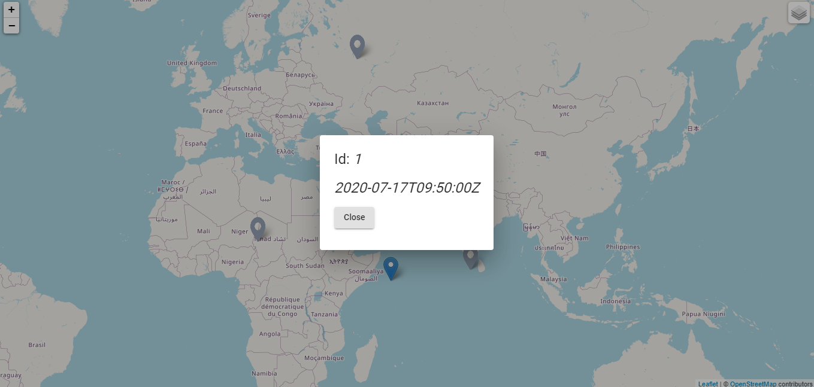

# Dashboard
 Base functionality. Creating on a map two markers with layers control. Dialog components with info opening by clicking on a marker.

**using ngx-leaflet with Angular CLI** [see more](https://asymmetrik.com/ngx-leaflet-tutorial-angular-cli/)

