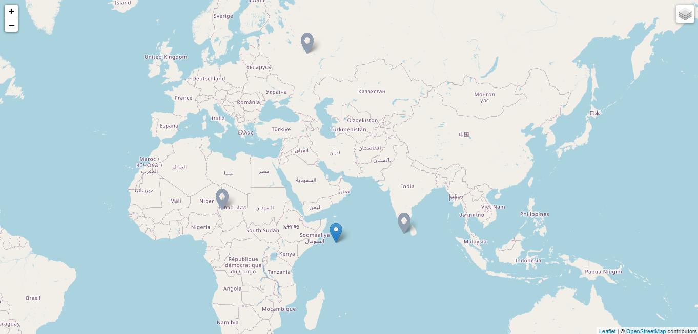
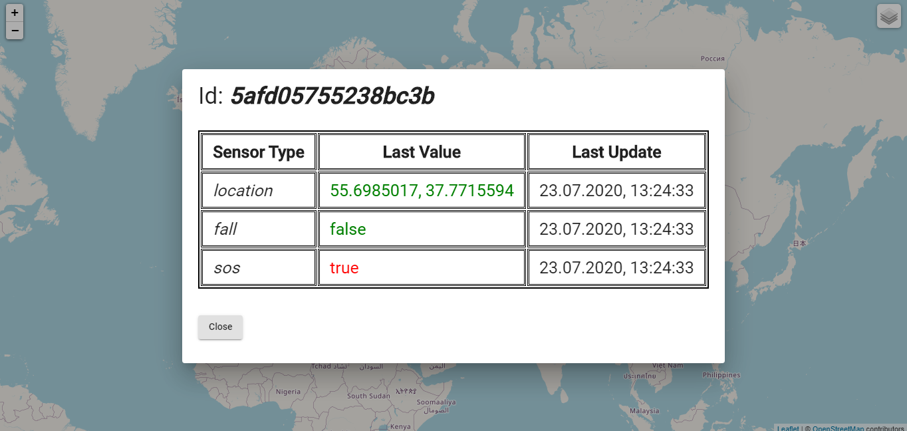
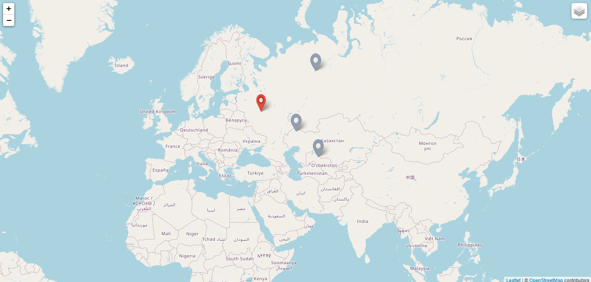

# Health Tracker
****
HealthTracker is an end-to-end solution to worker safety. HealthTracker warns workers of potentially harmful conditions and notifies managers and rescue teams should an accident happen, even in the absence of direct network connection.     

**Products**
* [Server API] - Server application for controlling data
* [Mobile App] - Mobile application
* [Monitoring Dashboard] - The Rescue Team Dashboard         

# Further development!
  - P2P-based system
  - Graphical representation of sensor performance history
  - History of sensors
  - Sensors support
And of course physical access control system     
          
   [Monitoring Dashboard]: <https://github.com/outsidious/health-tracker-monitoring-dashboard>     
   [Server API]: <https://github.com/q00Dree/HealthTracker-Backend-WebAPI>     
   [Mobile App]: <https://github.com/Sakerini/Health-Tracker-Android-MVVM>      

_______________________________________________________________________________________________________________________________________________       
_______________________________________________________________________________________________________________________________________________
_______________________________________________________________________________________________________________________________________________
         
# Monitoring Dashboard
Creating on a map markers from `https://lg.perf.group/` with **http get** every `'environments.update_time'`. If user is offline - grey marker.  

 

 Dialog components with info getting by ***http get*** opening by clicking on a marker. Sensors values with alert state dedicated with red. 
 Dialog is updating each `'environments.sensors_update_time'`.
  
 
  
 If one of user's sensors alert state is true - red marker and alarm.  
   
   

**using ngx-leaflet with Angular CLI** [see more](https://asymmetrik.com/ngx-leaflet-tutorial-angular-cli/)

